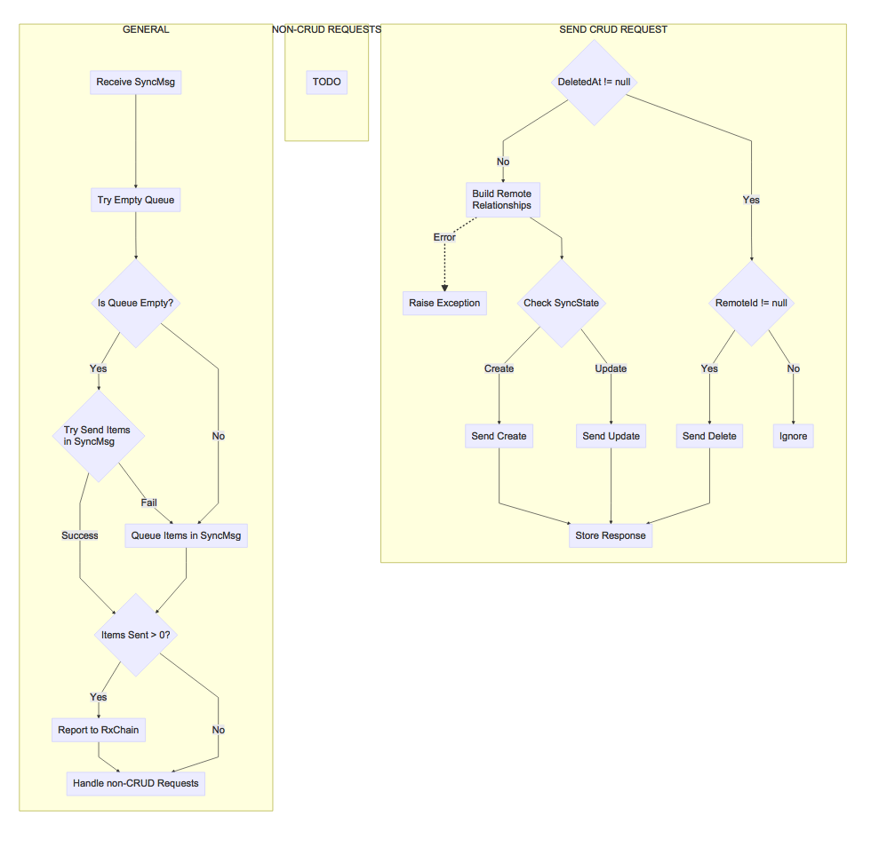

# Unidirectional Architecture

This document gives an overview of Toggl mobile apps architecture and its main
components which form the _ReactiveChain_ (`RxChain`). So called because [Reactive Extensions](http://reactivex.io)
are used to pass messages from one component to another in an asynchronous fashion.

- AppState
- Reducers
- SyncManager
- ViewModels


## AppState

The architecture is loosely related to [Redux](http://redux.js.org), that is,
to prevent conflicts when different components try to mutate shared variables,
all the values that must be accessed globally are contained in a single object
(the _source of truth_ or `AppState` in our case). This object is immutable
and is kept by the `StoreManager`. State updates can only be done by **reducers**
(see below). Every time a component wants to update the `AppState` a message
is sent to the `StoreManager` which passes the message an the current state
to the appropriate reducer.

## Reducers

Reducers are just functions prepared to update the `AppState`. In our app they
have the following signature:

```csharp
DataSyncMsg<AppState> Reducer(AppState state, DataMsg msg)
```

They receive a message and the current `AppState` and return a different
kind of message, `DataSyncMsg` which contains requests for the `SyncManager`
and the updated state.

In our architecture reducers are not pure functions as they access the database
(ideally, only reducers should touch the database) but besides that, they should
be self-contained and not access any other component. This makes it much simpler
to locate the source of errors.

All reducers compose to a single reducer responsible of updating the `AppState`.
Here we only have the `TagCompositeReducer` which decides which reducer to
apply upon the message tag (=type). All reducers are included in the same file,
making it easy for the programmer to have a quick overview of the possible
actions to update the `AppState`.

As the `AppState` is immutable, reducers cannot modify it, they always return
a new copy with the updated fields (the `With` method is used for that purpose).
This prevents conflicts if a ViewModel is accessing the old copy of the AppState
at the same time from another thread.

## SyncManager

The overall workflow can be seen in the following diagram:



A key component of the `SyncManager` is the **queue**. The queue is used to simplify
the handling of messages when there's no internet connection available. Instead of
relying on a flag like `IsSynced` to query records which need to be synced, reducers
can send server requests to the `SyncManager` as events happen (time entry creation,
editing...) and forget about internet availability. The `SyncManager` will try to
connect with Toggl server, but if that's not possible, it will store the message in
the queue to try again in the next cycle.

> Database records actually contain a field named `SyncState`. However this is mainly
used for the UI (e.g., to indicate which entries are synced and which not) and not to
filter the records for bulk syncing.

The queue is persistent and it's implemented just as a hidden table in the same SQLite
database used to store other offline data.

As `SyncManager` operations usually involve internet connection with Toggl server,
it can be affected by [back pressure](http://reactivex.io/documentation/operators/backpressure.html) issues:
i.e., notifications from `StoreManager` come too quickly before the previous
event has been dealt with. To prevent problems a [TPL ActionBlock](https://msdn.microsoft.com/en-us/library/hh228603.aspx)
is used to buffer messages and handle them sequentially:

```csharp
var blockOptions = new ExecutionDataflowBlockOptions
{
    MaxDegreeOfParallelism = 1,
    BoundedCapacity = BufferSize
};
var processingBlock = new ActionBlock<DataSyncMsg<AppState>> (async(DataSyncMsg<AppState> msg) =>
{
    await EnqueueOrSend(msg);
}, blockOptions);

StoreManager.Singleton
.Observe()
.Subscribe(processingBlock.AsObserver());
```

> Note that setting `MaxDegreeOfParallelism` to 1 means the messages will always
be processed sequentially and not in parallel.

> There were some conflicts to build the iOS app when adding the `TPL DataFlow`
nuget package. Instructions to fix the problem can be found [here](https://kb.xamarin.com/customer/portal/articles/2161671-how-can-i-resolv).


## ViewModels

ViewModels are the classes that control the logic for each view (usually
a screen) in the UI. They're shared between the Android and iOS projects.
ViewModels subscribe to `AppState` changes through `StoreManager.Observe`
and send messages to modify the state with `RxChain.Send`. Accessing the
`AppState` directly is not preferable but if necessary can be done throug
`StoreManager.Singleton.AppState`.

A difficulty with the `RxChain` model is sometimes ViewModels need to do
an action right after updating the state. In theses cases, it's possible to
pass a continuation together with the message sent to `RxChain`. With this
mechanism is also possible to use `async/await`:

```csharp
var tcs = new TaskCompletionSource<ITimeEntryData> ();

RxChain.Send(new DataMsg.TimeEntryStart(), new RxChain.Continuation((state) =>
{
    ServiceContainer.Resolve<ITracker> ().SendTimerStartEvent(TimerStartSource.AppNew);
    tcs.SetResult(StoreManager.Singleton.AppState.ActiveEntry.Data);
}));

await tcs.Task;
```

Another point to consider when dealing with `Rx` messages from the ViewModels
is that the notifications from `StoreManager` are usually raised in a background
thread. If we need to update the UI we have to be sure our code runs on the
UI thread using `ObserveOn`:

```csharp
public TimeEntryCollectionVM(TimeEntryGroupMethod groupMethod, SynchronizationContext uiContext)
{
    grouper = new TimeEntryGrouper(groupMethod);
    disposable = StoreManager
                    .Singleton
                    .Observe(x => x.State.TimeEntries)
                    .DistinctUntilChanged()
                    .ObserveOn(uiContext) // Code after this will be run on the UI thread
                    .Select(x => x.Values)
                    .Scan(new InnerState(), GetDiffsFromNewValues)
                    .Subscribe(state => UpdateCollection(state.Diffs));
}
```

In some more complex scenarios, we may want to do part of the work of the pipeline
on the background and finalize on the UI thread. In these cases we can use a combination
of `SubscribeOn` and `ObserveOn`. These methods work as follows:

- `SubscribeOn`: schedules the thread for the **whole** pipeline. To make the intention
  clearer is better to put `SubscribeOn` on top of the pipeline.
- `ObserveOn`: schedules the thread for the steps **below**.

```csharp
Observable.FromEventPattern<string>(h => DescriptionChanged += h, h => DescriptionChanged -= h)
    // Observe on the task pool to prevent locking UI
    .SubscribeOn(TaskPoolScheduler.Default)
    .Select(ev => ev.EventArgs)
    .Throttle(TimeSpan.FromMilliseconds(LoadSuggestionsThrottleMilliseconds))
    .Select(desc => LoadSuggestions(desc))
    // Go back to current context (UI thread)
    .ObserveOn(SynchronizationContext.Current)
    .Subscribe(result => SuggestionsCollection = result);
```